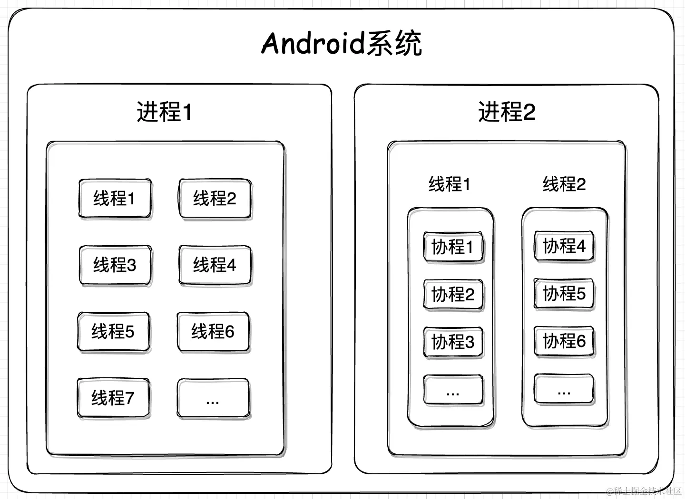
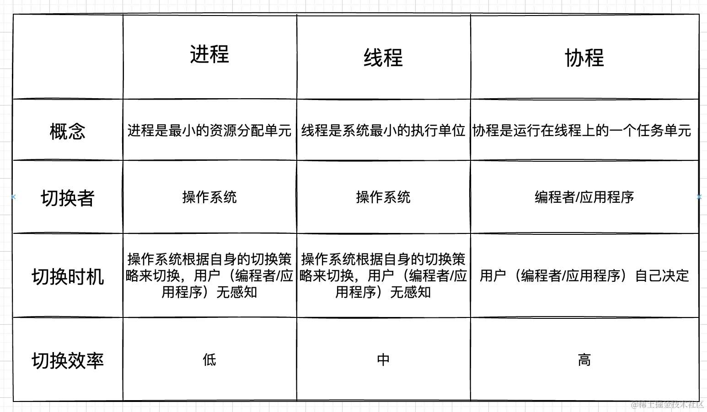

# Kotlin 协程

协程，英文Coroutine [kəru’tin] （可入厅），是计算机程序的一类组件，推广了协作式多任务的子程序，允许执行被挂起与被恢复。





## 协程的作用
协程通过将复杂性放入库来简化异步编程。程序的逻辑可以在协程中顺序地表达，而底层库会为我们解决其异步性。该库可以将用户代码的相关部分包装为回调、订阅相关事件、在不同线程（甚至不同机器！）上调度执行，而代码则保持如同顺序执行一样简单。

## 协程各个组件

### Job
Job我们可以认为他就是一个协程作业是通过CoroutineScope.launch生成的，同时它运行一个指定的代码块，并在该代码块完成时完成。我们可以通过isActive、isCompleted、isCancelled来获取到Job的当前状态。
下图标明了一个协程生命周期从创建到结束的过程和对应的生命周期方法
```
+-----+ start  +--------+ complete   +-------------+  finish  +-----------+
| New | -----> | Active | ---------> | Completing  | -------> | Completed |
+-----+        +--------+            +-------------+          +-----------+
                 |  cancel / fail       |
                 |     +----------------+
                 |     |
                 V     V
             +------------+                           finish  +-----------+
             | Cancelling | --------------------------------> | Cancelled |
             +------------+                                   +-----------+
```

### 协程作用域
协程作用域(Coroutine Scope)是协程运行的作用范围。launch、async都是CoroutineScope的扩展函数，CoroutineScope定义了新启动的协程作用范围，同时会继承了他的coroutineContext自动传播其所有的elements和取消操作。换句话说，如果这个作用域销毁了，那么里面的协程也随之失效。