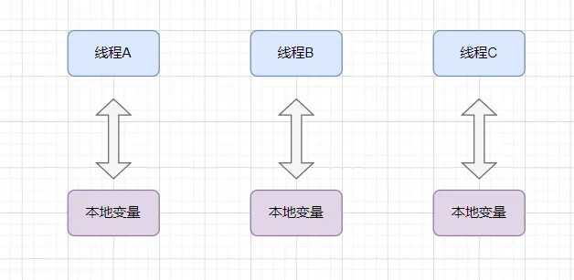

# ThreadLocal

ThreadLocal 表示线程的“本地变量”，即每个线程都拥有该变量副本，达到人手一份的效果，各用各的，这样就可以避免共享资源的竞争。
这是一种“空间换时间”的方案，虽然会让内存占用大很多，但是由于不需要同步也就减少了线程可能存在的阻塞等待，从而提高时间效率。

```java
private static final ThreadLocal<String> threadLocal = ThreadLocal.withInitial(() -> "init");

public static void main(String[] args) throws InterruptedException {
    new Thread(new thread1()).start();
    new Thread(new thread2()).start();
    Thread.sleep(5000);
}

static class thread1 implements Runnable {
    @Override
    public void run() {
        try {
            Thread.sleep(1000);
        } catch (InterruptedException e) {
            throw new RuntimeException(e);
        }
        System.out.println(Thread.currentThread().getName() + "  " + threadLocal.get());
        // ThreadLocal 的 remove() 方法是释放线程局部变量资源的重要手段，可以有效地避免内存泄漏。
        threadLocal.remove();
    }
}

static class thread2 implements Runnable {
    @Override
    public void run() {
        threadLocal.set("4321");
        try {
            Thread.sleep(2000);
        } catch (InterruptedException e) {
            throw new RuntimeException(e);
        }
        System.out.println(Thread.currentThread().getName() + "  " + threadLocal.get());
        // 清除数据，防止内存泄漏
        threadLocal.remove();
    }
}
```

## 使用场景
解决线程安全问题，可以使用加锁来进行访问，但是加锁会导致线程阻塞。加锁方式如下图


但是使用ThreadLocal后，可以在每一个线程中创建一个副本，对副本进行操作。减少了阻塞的时间，提高效率


## 原理
```java
public class Thread implements Runnable {

    ThreadLocal.ThreadLocalMap threadLocals = null;

    static class ThreadLocalMap {
        static class Entry extends WeakReference<ThreadLocal<?>> {
            Object value;

            Entry(ThreadLocal<?> k, Object v) {
                super(k);
                value = v;
            }
        }
    }
}
```
```java
public class ThreadLocal<T> {
    
    public T get() {
        Thread t = Thread.currentThread();
        ThreadLocalMap map = getMap(t);
        if (map != null) {
            ThreadLocalMap.Entry e = map.getEntry(this);
            if (e != null) {
                @SuppressWarnings("unchecked")
                T result = (T)e.value;
                return result;
            }
        }
        return setInitialValue();
    }
    
    private T setInitialValue() {
        T value = initialValue();
        Thread t = Thread.currentThread();
        ThreadLocalMap map = getMap(t);
        if (map != null)
            map.set(this, value);
        else
            createMap(t, value);
        return value;
    }
}
```

首先Thread类内部维护了一个ThreadLocalMap键值对，用来存储没个线程的ThreadLocal变量
